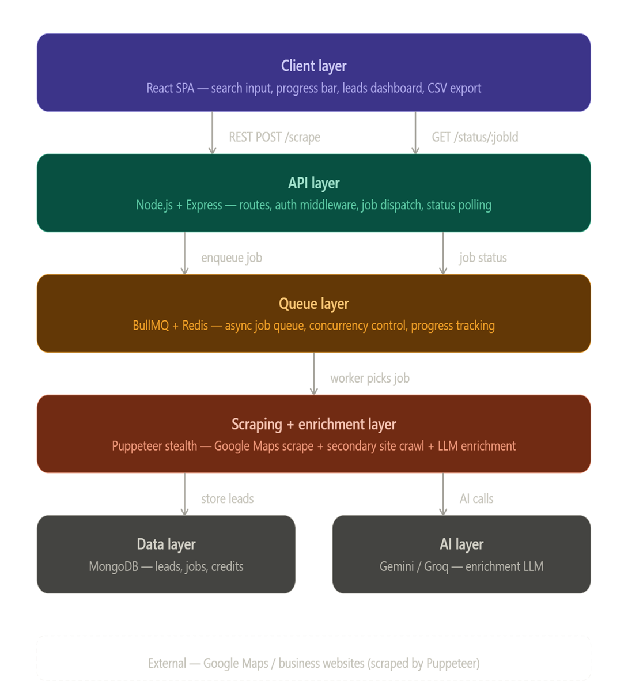
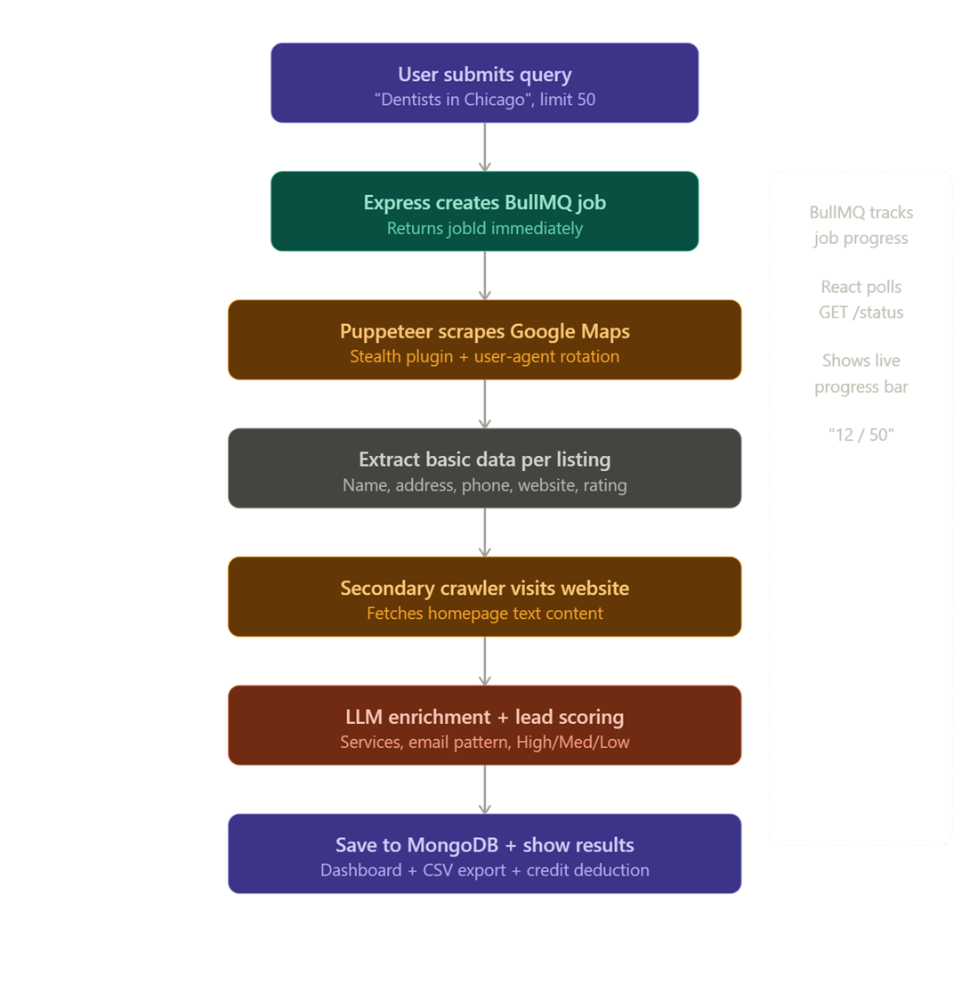

# ProspectMiner AI

<div align="center">


**An AI-powered lead generation and enrichment engine built for sales teams.**

[](https://nodejs.org)
[](https://reactjs.org)
[](https://mongodb.com)
[](https://redis.io)
[](./LICENSE)

</div>

---

## Table of Contents
- [Project Overview](#project-overview)
- [Key Features](#key-features)
- [Features Completed](#features-completed)
- [Application Preview](#application-preview)
- [Tech Stack](#tech-stack)
- [Getting Started for Contributors](#getting-started-for-contributors)
  - [Prerequisites](#prerequisites)
  - [Clone the Repository](#clone-the-repository)
  - [Cloning Your Fork](#cloning-your-fork)
- [Development Setup](#development-setup)
  - [Docker Setup](#docker-setup)
  - [Local Setup](#local-setup)
  - [Environment Variables](#environment-variables)
- [Project Structure](#project-structure)
- [System Architecture](#system-architecture)
- [Contributors](#contributors)
- [License](#license)
- [Acknowledgements](#acknowledgements)

## Project Overview

ProspectMiner AI is a full-stack SaaS application developed as part of the **Q4 AI Innovation Lab Roadmap** at **Infotact Solutions**. It is designed to eliminate the manual, time-consuming process of building lead lists for sales teams.

A user simply enters a search query such as **"Dentists in Chicago"** and a lead limit. ProspectMiner AI then:

1. Scrapes **Google Maps** using a stealth Puppeteer browser to extract business listings
2. Visits each business website individually to collect deeper information
3. Passes the extracted content through an **LLM enrichment layer** (Gemini / Groq) to extract services, email patterns, and a lead qualification score
4. Returns a fully enriched, scored, and exportable lead list — ready for outreach

The system is built on a **production-grade agentic architecture** using the MERN stack augmented with BullMQ job queues, Redis, and AI-powered enrichment pipelines — ensuring scalability, reliability, and real business value.

> Built by the AI Product Engineering Team — Unit Delta, Infotact Solutions.
---

## Key Features

### Stealth Scraping Pipeline
- Scrapes **Google Maps / Google Search** using Puppeteer with the stealth plugin
- Rotates User-Agents to avoid bot detection
- Scrolls and paginates results automatically to hit the requested lead limit
- Extracts name, address, phone number, website URL, and rating per listing

### AI Enrichment Layer
- Secondary crawler visits each business website individually
- Strips raw HTML to clean plain text before sending to the LLM
- LLM extracts **key services**, **email pattern**, and **owner name**
- Every lead is scored **High / Medium / Low** based on website quality,
  keyword density, and relevance to the original query

### Async Job Queue
- Built on **BullMQ + Redis** — scraping runs as a background job
- Express API stays fully responsive while jobs run in a separate worker process
- Real-time progress updates streamed to the frontend — "Scraping 12/50..."
- Supports **concurrent jobs**, **retry logic**, and a **dead letter queue**
  for failed jobs

### Analytics Dashboard
- Lead score distribution per job — High / Medium / Low breakdown
- Leads scraped over time — line chart
- Top performing queries ranked by High lead percentage
- Average rating per niche

### Search History
- Every scrape job is saved with its query, date, lead count, and credits spent
- Reload leads from any past job instantly — no re-scraping needed
- Delete old jobs and their associated leads

### Credit System
- Every user has a credit balance — **1 credit = 1 lead scraped**
- Credits are checked atomically before a job starts
- Credit usage history available per user
- Designed for future monetization and plan-based access control

### Export
- Export any lead list to **CSV** with one click
- Exports only the currently filtered results — not the entire dataset
- Columns: Business Name, Address, Phone, Website, Rating,
  Lead Score, Email Pattern, Services

### Authentication
- JWT-based authentication — register, login, logout
- All scraping and data routes are protected behind auth middleware
- Passwords stored as bcrypt hashes — never in plain text
---

## Features Completed

> This project is currently in the **design and planning phase**.
> Active development begins once designs and architecture are finalized.

| Feature | Status |
|---|---|
| System Architecture (HLD + LLD) | ✅ Complete |
| Backend Folder Structure | ✅ Complete |
| Frontend Folder Structure | ✅ Complete |
| API Design & Documentation | ✅ Complete |
| Database Schema Design | ✅ Complete |
| Figma Designs (Wireframes) | 🔄 In Progress |
| Figma Designs (Hi-Fi) | 🔄 In Progress |
| Project Setup & Folder Structure | 🔜 Pending |
| MongoDB + Redis Connection | 🔜 Pending |
| User Auth (Register + Login + JWT) | 🔜 Pending |
| Scrape Routes + Controller | 🔜 Pending |
| BullMQ Queue Setup | 🔜 Pending |
| Puppeteer Scraper (Google Maps) | 🔜 Pending |
| Secondary Website Crawler | 🔜 Pending |
| LLM Enrichment Layer | 🔜 Pending |
| Lead Scoring | 🔜 Pending |
| Lead Saving to MongoDB | 🔜 Pending |
| Progress Tracking | 🔜 Pending |
| History Module | 🔜 Pending |
| Analytics Module | 🔜 Pending |
| Credit System | 🔜 Pending |
| CSV Export | 🔜 Pending |
| Frontend — Auth Pages | 🔜 Pending |
| Frontend — HomePage | 🔜 Pending |
| Frontend — ResultsPage | 🔜 Pending |
| Frontend — HistoryPage | 🔜 Pending |
| Frontend — AnalyticsPage | 🔜 Pending |
| Docker Setup | 🔜 Pending |

### Legend
| Symbol | Meaning |
|---|---|
| ✅ | Complete |
| 🔄 | In Progress |
| 🔜 | Pending |
| ❌ | Blocked |

## Tech Stack

### Frontend
| Technology | Purpose |
|---|---|
| React 18 | UI framework |
| React Router v6 | Client-side routing |
| Axios | HTTP requests to backend |
| Context API | Global state management (auth + leads) |
| Vite | Build tool and dev server |

### Backend
| Technology | Purpose |
|---|---|
| Node.js 18+ | Runtime environment |
| Express.js | REST API framework |
| JSON Web Token (JWT) | Authentication and route protection |
| Bcrypt | Password hashing |
| Mongoose | MongoDB ODM — schema and queries |
| Dotenv | Environment variable management |

### Queue & Async Processing
| Technology | Purpose |
|---|---|
| BullMQ | Job queue management |
| Redis | Job state and progress persistence |
| Puppeteer | Headless Chrome browser automation |
| puppeteer-extra-plugin-stealth | Bot detection evasion |

### AI & Enrichment
| Technology | Purpose |
|---|---|
| Gemini 1.5 Flash (Google AI Studio) | Primary LLM for lead enrichment |
| Groq (Llama 3) | Fallback LLM for high-speed inference |
| LangChain.js | LLM orchestration and prompt chaining |

### Database
| Technology | Purpose |
|---|---|
| MongoDB Atlas | Primary database — leads, jobs, users |
| Redis | BullMQ job store + caching layer |

### DevOps & Deployment
| Technology | Purpose |
|---|---|
| Docker | Containerization of API + worker processes |
| Docker Compose | Multi-container orchestration (API + worker + Redis) |
| Render / Railway | Backend deployment |
| Vercel | Frontend deployment |

### Development Tools
| Technology | Purpose |
|---|---|
| ESLint | Code linting |
| Prettier | Code formatting |
| Nodemon | Auto-restart during development |
| Postman | API testing |
---

## System Architecture

### High Level Design (HLD)

ProspectMiner AI is built on a **5-layer architecture** where each layer has a
single, clearly defined responsibility.


---

### Two Process Architecture

A critical architectural decision is running the API and the worker as
**two completely separate processes.**
```
┌─────────────────────┐        ┌─────────────────────┐
│     server.js       │        │     worker.js        │
│                     │        │                      │
│   Express API       │        │   BullMQ Worker      │
│   Handles HTTP      │        │   Handles scraping   │
│   Dispatches jobs   │        │   Runs enrichment    │
│                     │        │   Updates progress   │
└────────┬────────────┘        └──────────┬───────────┘
         │                                │
         │         ┌──────────┐           │
         └────────►│  Redis   │◄──────────┘
                   │          │
                   │ Shared   │
                   │ job store│
                   └──────────┘
```

> A crash in the worker **never affects** the API server.
> The API always stays responsive regardless of scraping failures.

---

### Request Lifecycle

From the moment a user clicks "Find Leads" to seeing results:
```
1. User submits query + limit
        │
        ▼
2. POST /api/scrape
   → validate input
   → check user credits
   → enqueue BullMQ job
   → return { jobId }
        │
        ▼
3. Frontend polls GET /api/scrape/status/:jobId
   every 2 seconds
        │
        ▼
4. BullMQ worker picks up job
   → Puppeteer launches browser (stealth)
   → Scrapes Google Maps
   → Extracts basic lead data
        │
        ▼
5. For each lead:
   → Secondary crawler visits website
   → Strips HTML → clean text
   → LLM enrichment call
   → Score lead High / Medium / Low
   → Save enriched lead to MongoDB
   → job.updateProgress(count)
        │
        ▼
6. Job state → "completed"
   → Frontend fetches GET /api/scrape/leads/:jobId
   → Leads loaded into React state
   → Table renders with full enriched data
```

---

### Data Flow Diagram


---

### Database Schema
```
users
  ├── _id
  ├── email         (unique index)
  ├── passwordHash
  ├── credits
  ├── createdAt
  └── updatedAt

jobs
  ├── _id
  ├── userId        (ref: users — index)
  ├── query
  ├── limit
  ├── status
  └── createdAt

leads
  ├── _id
  ├── jobId         (ref: jobs — index)
  ├── name
  ├── address
  ├── phone
  ├── website
  ├── rating
  ├── score
  ├── services      [ ]
  ├── emailPattern
  └── createdAt
```

> **Index strategy** — indexes on `users.email`, `jobs.userId`,
> and `leads.jobId` ensure all critical queries run in O(log n)
> rather than full collection scans.

## API Documentation

### Base URL
```
Development  →  http://localhost:5000/api
Production   →  https://your-domain.com/api
```

### Authentication
All routes except `/auth/register` and `/auth/login` require a
JWT token in the request header.
```
Authorization: Bearer <your_jwt_token>
```

---

### Auth Module

#### Register
```
POST /auth/register
```
Request Body:
```json
{
  "email": "user@example.com",
  "password": "password123"
}
```
Response `201`:
```json
{
  "success": true,
  "token": "eyJhbGciOiJIUzI1NiJ9...",
  "user": {
    "_id": "64f1a2b3c4d5e6f7a8b9c0d1",
    "email": "user@example.com",
    "credits": 50
  }
}
```
Error `400` — validation failed:
```json
{
  "success": false,
  "message": "Email already in use"
}
```

---

#### Login
```
POST /auth/login
```
Request Body:
```json
{
  "email": "user@example.com",
  "password": "password123"
}
```
Response `200`:
```json
{
  "success": true,
  "token": "eyJhbGciOiJIUzI1NiJ9...",
  "user": {
    "_id": "64f1a2b3c4d5e6f7a8b9c0d1",
    "email": "user@example.com",
    "credits": 50
  }
}
```
Error `401` — wrong credentials:
```json
{
  "success": false,
  "message": "Invalid email or password"
}
```

---

### Scrape Module

#### Start Scrape Job
```
POST /scrape
```
> Protected — requires JWT

Request Body:
```json
{
  "query": "Dentists in Chicago",
  "limit": 50
}
```
Response `201`:
```json
{
  "success": true,
  "jobId": "42",
  "message": "Scrape job queued successfully"
}
```
Error `402` — insufficient credits:
```json
{
  "success": false,
  "message": "Insufficient credits. You need 50 credits but have 20."
}
```
Error `400` — validation failed:
```json
{
  "success": false,
  "message": "Query is required"
}
```

---

#### Get Job Status
```
GET /scrape/status/:jobId
```
> Protected — requires JWT

Response `200` — job active:
```json
{
  "success": true,
  "state": "active",
  "progress": 12,
  "total": 50,
  "failReason": null
}
```
Response `200` — job completed:
```json
{
  "success": true,
  "state": "completed",
  "progress": 50,
  "total": 50,
  "failReason": null
}
```
Response `200` — job failed:
```json
{
  "success": true,
  "state": "failed",
  "progress": 23,
  "total": 50,
  "failReason": "Puppeteer rate limited by Google"
}
```

---

#### Get Leads for a Job
```
GET /scrape/leads/:jobId
```
> Protected — requires JWT

Response `200`:
```json
{
  "success": true,
  "count": 50,
  "leads": [
    {
      "_id": "64f1a2b3c4d5e6f7a8b9c0d2",
      "jobId": "42",
      "name": "Chicago Dental Care",
      "address": "123 Main St, Chicago, IL 60601",
      "phone": "+1 312-555-0101",
      "website": "https://chicagodentalcare.com",
      "rating": "4.7",
      "score": "High",
      "services": ["General Dentistry", "Cosmetic Dentistry"],
      "emailPattern": "info@chicagodentalcare.com",
      "createdAt": "2025-12-01T10:30:00.000Z"
    }
  ]
}
```

---

### History Module

#### Get All Past Jobs
```
GET /history
```
> Protected — requires JWT

Response `200`:
```json
{
  "success": true,
  "count": 5,
  "jobs": [
    {
      "_id": "64f1a2b3c4d5e6f7a8b9c0d3",
      "query": "Dentists in Chicago",
      "limit": 50,
      "status": "completed",
      "leadCount": 50,
      "creditsSpent": 50,
      "createdAt": "2025-12-01T10:30:00.000Z"
    }
  ]
}
```

---

#### Delete a Job
```
DELETE /history/:jobId
```
> Protected — requires JWT

Response `200`:
```json
{
  "success": true,
  "message": "Job and associated leads deleted successfully"
}
```
Error `404` — job not found:
```json
{
  "success": false,
  "message": "Job not found"
}
```

---

### Analytics Module

#### Get Analytics Summary
```
GET /analytics/summary
```
> Protected — requires JWT

Response `200`:
```json
{
  "success": true,
  "data": {
    "totalLeads": 350,
    "totalJobs": 7,
    "creditsUsed": 350,
    "scoreDistribution": {
      "High": 180,
      "Medium": 120,
      "Low": 50
    },
    "leadsOverTime": [
      { "date": "2025-11-25", "count": 50 },
      { "date": "2025-11-28", "count": 100 },
      { "date": "2025-12-01", "count": 200 }
    ],
    "topQueries": [
      {
        "query": "Dentists in Chicago",
        "totalLeads": 50,
        "highPercent": 72,
        "avgRating": 4.5
      }
    ]
  }
}
```

---

### Credits Module

#### Get Credit Balance
```
GET /credits/balance
```
> Protected — requires JWT

Response `200`:
```json
{
  "success": true,
  "credits": 150
}
```

---

#### Get Credit Usage History
```
GET /credits/usage
```
> Protected — requires JWT

Response `200`:
```json
{
  "success": true,
  "usage": [
    {
      "jobId": "42",
      "query": "Dentists in Chicago",
      "creditsSpent": 50,
      "date": "2025-12-01T10:30:00.000Z"
    }
  ]
}
```

---

### Error Response Format

All errors follow this consistent shape:
```json
{
  "success": false,
  "message": "Human readable error message",
  "stack": "Only visible in development mode"
}
```

### HTTP Status Codes Used

| Code | Meaning |
|---|---|
| `200` | OK — request successful |
| `201` | Created — resource created |
| `400` | Bad Request — validation failed |
| `401` | Unauthorized — missing or invalid token |
| `402` | Payment Required — insufficient credits |
| `404` | Not Found — resource does not exist |
| `429` | Too Many Requests — rate limit hit |
| `500` | Internal Server Error — something crashed |

## Getting Started for Contributors

### Prerequisites

Make sure you have the following installed on your machine before starting:

| Tool | Version | Download |
|---|---|---|
| Node.js | 18+ | https://nodejs.org |
| npm | 9+ | comes with Node.js |
| Git | latest | https://git-scm.com |
| Docker Desktop | latest | https://docker.com |
| MongoDB Atlas Account | — | https://cloud.mongodb.com |
| Redis | 7+ | via Docker (recommended) |

---

### Repo Structure

This is a **monorepo** — both frontend and backend live in the same repository.
```
ProspectMiner-AI/
  ├── client/       → React frontend
  └── server/       → Node.js backend
```

---

### Clone the Repository
```bash
# Clone the repo
git clone https://github.com/your-org/ProspectMiner-AI.git

# Navigate into the project
cd ProspectMiner-AI
```

---

### Branch Strategy

We follow a simple branch naming convention.
**Never push directly to `main`.**
```
main          → stable, production-ready code only
dev           → active development branch
               merge your work here first

feature/your-feature-name    → new features
fix/your-fix-name            → bug fixes
chore/your-task-name         → setup, config, docs
```

**Examples:**
```
feature/auth-module
feature/scrape-routes
fix/puppeteer-timeout
chore/docker-setup
chore/readme-update
```

**Workflow for every task:**
```bash
# 1. Always pull latest dev before starting
git checkout dev
git pull origin dev

# 2. Create your feature branch from dev
git checkout -b feature/your-feature-name

# 3. Make your changes, then stage and commit
git add .
git commit -m "feat: add auth register route"

# 4. Push your branch
git push origin feature/your-feature-name

# 5. Open a Pull Request into dev on GitHub
#    → assign a reviewer (team lead)
#    → do NOT merge without review
```

---

### Commit Message Convention

Follow this format for every commit:
```
type: short description in lowercase
```

| Type | When to use |
|---|---|
| `feat` | adding a new feature |
| `fix` | fixing a bug |
| `chore` | setup, config, tooling |
| `docs` | documentation changes |
| `refactor` | code restructure, no behavior change |
| `style` | formatting, no logic change |
| `test` | adding or updating tests |

**Examples:**
```bash
git commit -m "feat: add BullMQ scrape queue setup"
git commit -m "fix: handle null website in lead enrichment"
git commit -m "chore: add docker-compose configuration"
git commit -m "docs: update API documentation"
git commit -m "refactor: extract credit logic into service layer"
```

---

### Who Works on What

| Team Member | Responsibility |
|---|---|
| You (Backend Lead) | server/ — all backend modules |
| Frontend Member 1 | client/ — auth pages + homepage |
| Frontend Member 2 | client/ — results + history + analytics |

> Frontend members should **never touch** the `server/` folder.
> Backend lead should **never touch** the `client/` folder.
> This prevents merge conflicts.

---

### Development Setup

#### Option 1 — Docker Setup (Recommended)

Docker runs everything — API, worker, and Redis — in one command.
No manual Redis installation needed.
```bash
# Navigate to server
cd server

# Copy environment variables
cp .env.example .env
# Fill in your values in .env

# Start all services
docker-compose up --build
```

This starts:
```
http://localhost:5000   → Express API
                        → BullMQ Worker (background)
http://localhost:6379   → Redis
```

To stop:
```bash
docker-compose down
```

---

#### Option 2 — Local Setup

If you prefer running without Docker:

**Backend:**
```bash
# Navigate to server
cd server

# Install dependencies
npm install

# Copy and fill environment variables
cp .env.example .env

# Start Redis separately (required)
# Install Redis locally or use Redis Cloud

# Terminal 1 — start API server
npm run dev

# Terminal 2 — start BullMQ worker
npm run worker
```

**Frontend:**
```bash
# Navigate to client
cd client

# Install dependencies
npm install

# Copy and fill environment variables
cp .env.example .env

# Start development server
npm run dev
```

Frontend runs at `http://localhost:5173`
Backend runs at `http://localhost:5000`

---

### Environment Variables

#### server/.env
```bash
PORT=5000

# Database
MONGODB_URI=mongodb+srv://<user>:<password>@cluster.mongodb.net/prospectminer

# Redis
REDIS_URL=redis://localhost:6379

# Auth
JWT_SECRET=your_super_secret_key_here
JWT_EXPIRES_IN=7d

# AI
GEMINI_API_KEY=your_gemini_api_key
GROQ_API_KEY=your_groq_api_key

# CORS
CLIENT_URL=http://localhost:5173
```

#### client/.env
```bash
VITE_API_URL=http://localhost:5000/api
```

> ⚠️ Never commit `.env` files to GitHub.
> `.env` is already in `.gitignore`.
> Ask the team lead for actual values over a private channel.

---

### Verify Everything is Running

Once setup is complete, verify each service:
```bash
# 1. Check backend is running
curl http://localhost:5000/api/health
# Expected: { "status": "ok" }

# 2. Check frontend is running
# Open http://localhost:5173 in your browser

# 3. Check Redis is running
# Docker: docker ps → should show redis container
# Local: redis-cli ping → should return PONG
```


## Project Structure
```
ProspectMiner-AI/
│
├── client/                           # React frontend
│   ├── public/
│   │
│   └── src/
│       ├── api/                      # axios calls — one file per module
│       │   ├── authApi.js            # register, login, logout
│       │   ├── scrapeApi.js          # start scrape, status, leads
│       │   ├── historyApi.js         # fetch + delete past jobs
│       │   ├── analyticsApi.js       # fetch analytics data
│       │   └── creditApi.js          # balance + usage history
│       │
│       ├── components/               # reusable UI components
│       │   ├── SearchBar/
│       │   ├── ProgressBar/
│       │   ├── LeadsTable/
│       │   ├── LeadCard/
│       │   ├── ExportButton/
│       │   ├── ScoreBadge/
│       │   ├── CreditBadge/
│       │   ├── Navbar/
│       │   └── ProtectedRoute/
│       │
│       ├── pages/                    # one page per route
│       │   ├── LoginPage/
│       │   ├── RegisterPage/
│       │   ├── HomePage/
│       │   ├── ResultsPage/
│       │   ├── HistoryPage/
│       │   └── AnalyticsPage/
│       │
│       ├── hooks/                    # custom hooks — logic out of components
│       │   ├── useScrape.js          # POST scrape + get jobId
│       │   ├── useJobStatus.js       # poll status + fetch leads
│       │   ├── useAuth.js            # login, register, logout
│       │   ├── useHistory.js         # fetch + delete past jobs
│       │   ├── useAnalytics.js       # fetch analytics data
│       │   └── useCredits.js         # credit balance + usage
│       │
│       ├── context/                  # global state
│       │   ├── AuthContext.jsx       # user, token, isLoggedIn
│       │   └── LeadsContext.jsx      # jobId, leads[]
│       │
│       ├── utils/                    # pure helper functions
│       │   ├── exportCsv.js          # leads[] → .csv download
│       │   ├── formatDate.js         # consistent date formatting
│       │   └── scoreColor.js         # score → color mapping
│       │
│       ├── constants/
│       │   └── routes.js             # all route strings in one place
│       │
│       ├── App.jsx                   # routes defined here
│       └── main.jsx                  # ReactDOM entry point
│
│
├── server/                           # Node.js backend
│   └── src/
│       ├── config/
│       │   ├── db.js                 # MongoDB connection
│       │   └── redis.js              # Redis connection
│       │
│       ├── middleware/
│       │   ├── authMiddleware.js     # verify JWT → attach req.user
│       │   ├── rateLimiter.js        # max requests per user
│       │   └── errorHandler.js       # global error → JSON response
│       │
│       ├── modules/                  # one folder per feature module
│       │   ├── auth/
│       │   │   ├── auth.routes.js
│       │   │   ├── auth.controller.js
│       │   │   ├── auth.service.js
│       │   │   └── auth.validator.js
│       │   │
│       │   ├── scrape/
│       │   │   ├── scrape.routes.js
│       │   │   ├── scrape.controller.js
│       │   │   └── scrape.service.js
│       │   │
│       │   ├── enrichment/
│       │   │   ├── llmClient.js
│       │   │   └── enrichLead.js
│       │   │
│       │   ├── history/
│       │   │   ├── history.routes.js
│       │   │   ├── history.controller.js
│       │   │   └── history.service.js
│       │   │
│       │   ├── analytics/
│       │   │   ├── analytics.routes.js
│       │   │   ├── analytics.controller.js
│       │   │   └── analytics.service.js
│       │   │
│       │   └── credits/
│       │       ├── credits.routes.js
│       │       ├── credits.controller.js
│       │       └── credits.service.js
│       │
│       ├── models/                   # Mongoose schemas
│       │   ├── User.js
│       │   ├── Job.js
│       │   └── Lead.js
│       │
│       ├── queue/
│       │   ├── scrapeQueue.js        # BullMQ Queue definition
│       │   └── scrapeWorker.js       # BullMQ Worker + processor
│       │
│       ├── scraper/
│       │   ├── browserManager.js     # Puppeteer launch + close
│       │   ├── mapsScraper.js        # Google Maps scraping
│       │   └── websiteCrawler.js     # secondary website crawler
│       │
│       └── utils/
│           ├── textCleaner.js        # strip HTML → plain text
│           ├── creditManager.js      # atomic credit check + deduct
│           ├── cacheManager.js       # query cache check + store
│           └── ApiError.js           # custom error class
│
├── server/server.js                  # entry point → Express API process
├── server/worker.js                  # entry point → BullMQ worker process
├── server/.env.example
├── server/Dockerfile
├── server/docker-compose.yml
├── server/package.json
│
├── client/.env.example
├── client/vite.config.js
├── client/package.json
│
└── README.md
```

---

### Key Architectural Boundaries
```
client/src/api/        → ONLY place that calls the backend
client/src/hooks/      → ONLY place that contains async logic
client/src/components/ → ONLY responsible for rendering UI
client/src/context/    → ONLY holds global shared state

server/src/modules/    → ONLY place for business logic
server/src/models/     → ONLY place for database queries
server/src/scraper/    → ONLY place for Puppeteer logic
server/src/queue/      → ONLY place for BullMQ logic
server/src/middleware/ → ONLY place for cross-cutting concerns
```

### File Naming Convention
```
Frontend
  Components   →  PascalCase     →  SearchBar.jsx
  Hooks        →  camelCase      →  useScrape.js
  Utilities    →  camelCase      →  exportCsv.js
  Pages        →  PascalCase     →  HomePage.jsx
  Context      →  PascalCase     →  AuthContext.jsx

Backend
  Routes       →  kebab-case     →  auth.routes.js
  Controllers  →  kebab-case     →  auth.controller.js
  Services     →  kebab-case     →  auth.service.js
  Models       →  PascalCase     →  User.js
  Utils        →  camelCase      →  textCleaner.js
```

## Roadmap

### Phase 1 — Foundation
- [ ] Project setup & monorepo structure
- [ ] MongoDB + Redis connection
- [ ] User auth — register, login, JWT
- [ ] Auth middleware — protect all routes

### Phase 2 — Core Pipeline
- [ ] Scrape routes + controller + service
- [ ] BullMQ queue + worker setup
- [ ] Puppeteer scraper — Google Maps
- [ ] Secondary website crawler
- [ ] LLM enrichment layer
- [ ] Lead scoring — High / Medium / Low
- [ ] Lead saving to MongoDB
- [ ] Real-time progress tracking

### Phase 3 — User Value
- [ ] History module — past jobs
- [ ] Credit system — check + deduct
- [ ] CSV export
- [ ] Frontend — all pages + components

### Phase 4 — Intelligence & Performance
- [ ] Analytics module — charts + insights
- [ ] Query result caching — 24hr TTL
- [ ] Parallel enrichment — batch processing
- [ ] Retry logic with exponential backoff
- [ ] Job prioritization — premium users
- [ ] Dead letter queue — failed jobs

### Phase 5 — Production
- [ ] Docker + docker-compose setup
- [ ] Environment hardening
- [ ] Rate limiting + security headers
- [ ] Deploy backend → Render / Railway
- [ ] Deploy frontend → Vercel
- [ ] End-to-end testing

---

## Module Structure

### Feature Modules Overview

| Module | Responsibility | Routes |
|---|---|---|
| Auth | Register, login, JWT | `/api/auth/*` |
| Scrape | Queue jobs, track progress | `/api/scrape/*` |
| Enrichment | LLM calls, lead scoring | internal only |
| History | Past jobs per user | `/api/history/*` |
| Analytics | Aggregated insights | `/api/analytics/*` |
| Credits | Balance, usage, deduction | `/api/credits/*` |

### Module Dependency Graph
```
Auth
  └── protects all other modules via authMiddleware

Scrape
  ├── depends on → Queue (BullMQ)
  ├── depends on → Credits (check before enqueue)
  └── feeds into → Enrichment

Enrichment
  ├── depends on → Scraper (Puppeteer)
  └── feeds into → Lead (MongoDB save)

History
  └── depends on → Job + Lead models

Analytics
  └── depends on → Job + Lead models (aggregation)

Credits
  └── depends on → User model
```

---

## Contributors

| Name | Role | GitHub |
|---|---|---|
| Vaibhav Sutar | Backend Lead | [@sutarvaibhav649](https://github.com/sutarvaibhav649) |
| Team Member 2 | Frontend — Auth + Home | [@SRD-web](https://github.com/SRD-web) |
| Team Member 3 | Frontend — Results + History + Analytics | [@SauravKumar2015](https://github.com/SauravKumar2015) |

> Built under the mentorship of the Lead AI Architect,
> **Infotact Solutions — AI Innovation Lab, Unit Delta.**
> December 2025.

---

## License
```
MIT License

Copyright (c) 2025 Infotact Solutions — AI Innovation Lab

Permission is hereby granted, free of charge, to any person obtaining
a copy of this software and associated documentation files (the
"Software"), to deal in the Software without restriction, including
without limitation the rights to use, copy, modify, merge, publish,
distribute, sublicense, and/or sell copies of the Software, and to
permit persons to whom the Software is furnished to do so, subject to
the following conditions:

The above copyright notice and this permission notice shall be included
in all copies or substantial portions of the Software.

THE SOFTWARE IS PROVIDED "AS IS", WITHOUT WARRANTY OF ANY KIND,
EXPRESS OR IMPLIED, INCLUDING BUT NOT LIMITED TO THE WARRANTIES OF
MERCHANTABILITY, FITNESS FOR A PARTICULAR PURPOSE AND NONINFRINGEMENT.
IN NO EVENT SHALL THE AUTHORS OR COPYRIGHT HOLDERS BE LIABLE FOR ANY
CLAIM, DAMAGES OR OTHER LIABILITY, WHETHER IN AN ACTION OF CONTRACT,
TORT OR OTHERWISE, ARISING FROM, OUT OF OR IN CONNECTION WITH THE
SOFTWARE OR THE USE OR OTHER DEALINGS IN THE SOFTWARE.
```

---

## Acknowledgements

- [Puppeteer](https://pptr.dev) — headless Chrome automation
- [puppeteer-extra-plugin-stealth](https://github.com/berstend/puppeteer-extra/tree/master/packages/puppeteer-extra-plugin-stealth) — bot detection evasion
- [BullMQ](https://docs.bullmq.io) — production-grade job queues
- [LangChain.js](https://js.langchain.com) — LLM orchestration
- [Google Gemini](https://ai.google.dev) — primary LLM for enrichment
- [Groq](https://groq.com) — high-speed LLM inference
- [MongoDB Atlas](https://cloud.mongodb.com) — cloud database
- [Redis](https://redis.io) — in-memory job store
- [Vite](https://vitejs.dev) — frontend build tool

---

<div align="center">

**ProspectMiner AI** — Built with purpose at Infotact Solutions.

*Data is the new oil. AI is the refinery.*

</div>